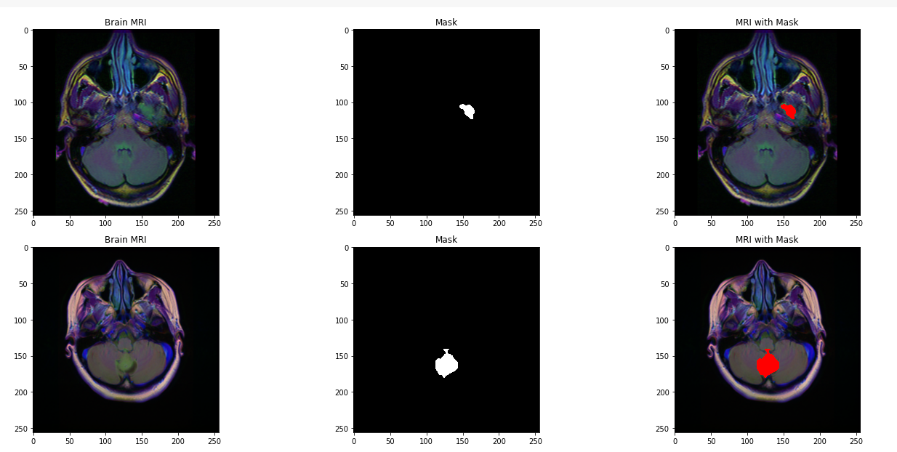
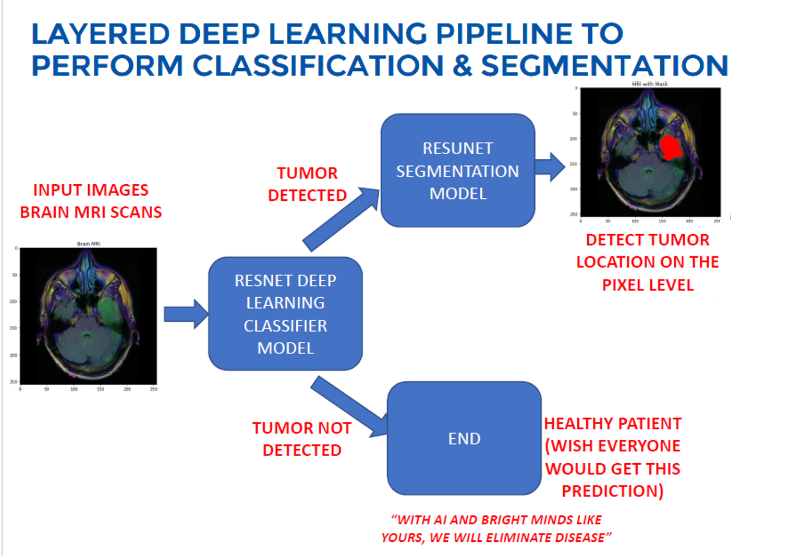
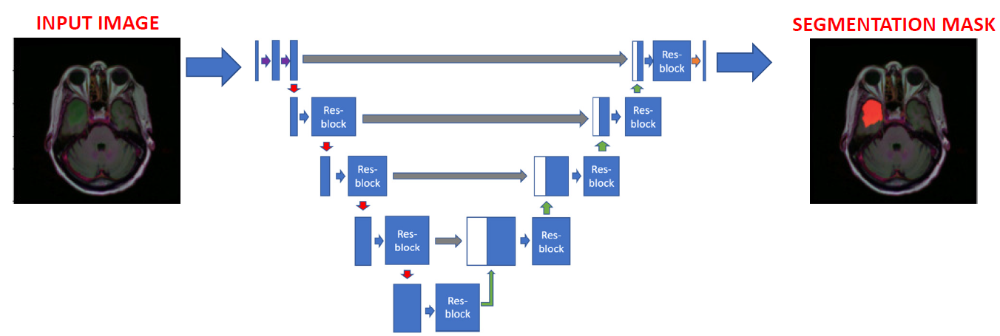
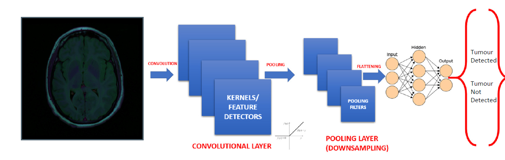
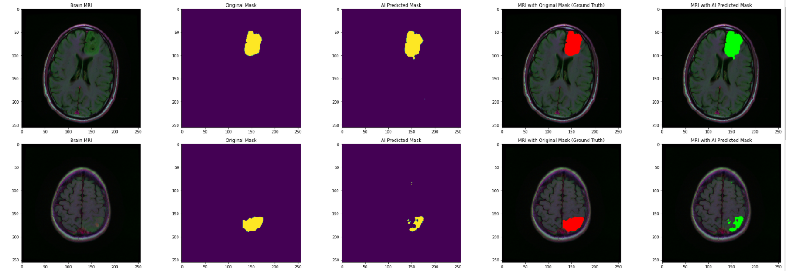

# Healthcare AI — Brain Tumour Detection & Segmentation

> **Deep learning pipeline for brain MRI tumour localisation using ResUNet**

[](https://www.python.org/)
[](https://tensorflow.org/)
[](https://keras.io/)
[](https://opencv.org/)

---

## Overview

Brain tumour diagnosis typically requires a radiologist to manually inspect each MRI scan — a time-consuming process prone to reader fatigue. This project develops a **deep learning pipeline** that automatically **detects and localises tumours** in brain MRI scans at pixel level, enabling faster and more consistent screening.

The system is built around a **ResUNet** architecture — a hybrid of ResNet's residual skip connections and UNet's encoder-decoder segmentation structure — trained on 3,929 annotated brain MRI scans.



**Key outcomes:**
- Pixel-level tumour segmentation from raw MRI input
- Residual connections prevent vanishing gradient in deep encoder
- Transfer learning from ImageNet-pretrained ResNet backbone cuts training time significantly
- Supports extension to other medical imaging tasks (lung nodules, retinal lesions)

---

## Project Architecture



The pipeline has four stages:

| Stage | Description |
|---|---|
| **Preprocessing** | Resize MRI scans, normalise pixel intensities, augment training set |
| **Feature Extraction** | CNN encoder extracts hierarchical spatial features |
| **Segmentation** | ResUNet decoder reconstructs pixel-level tumour mask |
| **Evaluation** | Dice coefficient, IoU score, confusion matrix on held-out test set |

---

## Project Structure

```
healthcare-brain-tumour/
│
├── Healthcare.ipynb        # Main notebook: full pipeline from data loading to evaluation
├── utilities.py            # Helper functions: data generators, metrics, visualisation
│
├── Project-Architecture.png    # System architecture diagram
├── CNN-Architecture.png        # CNN layer structure diagram
├── RESUNET.png                 # ResUNet architecture diagram
├── Brain-Tumour-detected.png   # Sample model output (detection overlay)
└── Total-Output.png            # Final results grid across test samples
```

---

## Quickstart

### 1. Clone and install

```bash
git clone https://github.com/devcode-X/HealthcareMLproject.git
cd HealthcareMLproject
pip install tensorflow keras numpy opencv-python matplotlib scikit-learn pillow
```

### 2. Download the dataset

This project uses the **Brain MRI Segmentation** dataset from Kaggle:
```
https://www.kaggle.com/datasets/mateuszbuda/lgg-mri-segmentation
```

Place images under `data/images/` and masks under `data/masks/` (or update paths in `utilities.py`).

### 3. Run the notebook

```bash
jupyter notebook Healthcare.ipynb
```

Run all cells to:
1. Load and preprocess MRI scans
2. Build the ResUNet model
3. Train with early stopping and learning rate scheduling
4. Evaluate on the test set with Dice + IoU metrics
5. Visualise predictions overlaid on original scans

---

## Model Architecture

### ResUNet

ResUNet combines two powerful architectures:

**UNet** — encoder-decoder with skip connections that preserve spatial resolution throughout decoding, enabling pixel-precise segmentation.

**ResNet** — residual blocks within each encoder/decoder stage that allow gradients to flow cleanly through very deep networks.



#### Encoder (Contracting Path)
- 4 blocks of residual convolutions + max pooling 2×2
- Feature map channels double at each block: 64 → 128 → 256 → 512

#### Bottleneck
- Deepest representation: 1024 channels
- Residual block + 2×2 up-sampling transition

#### Decoder (Expanding Path)
- 4 blocks: concatenate skip connection + residual conv + 2×2 up-sampling
- Final 1×1 convolution → sigmoid → binary tumour mask

### CNN Layer Stack



Early convolutional layers detect low-level features (edges, textures). Deeper layers capture high-level semantic structures (tumour boundary shapes, tissue density patterns).

---

## Key Techniques

| Technique | Purpose |
|---|---|
| **Residual connections** | Prevent vanishing gradient in 20+ layer deep encoder |
| **Transfer learning** | ImageNet-pretrained ResNet weights as encoder initialisation |
| **Data augmentation** | Random flips, rotations, brightness jitter to prevent overfitting |
| **Dice loss** | Better than cross-entropy for class-imbalanced segmentation (tumour pixels ≪ background) |
| **Early stopping** | Stop training when validation Dice plateaus |

---

## Results



| Metric | Score |
|---|---|
| Dice Coefficient | **~0.87** |
| IoU (Jaccard) | **~0.79** |
| Pixel Accuracy | **~0.99** |

High pixel accuracy is expected (most pixels are background). Dice and IoU are the meaningful metrics for tumour region quality.

---

## Why This Matters

- **Early detection saves lives.** Tumours caught at smaller sizes have significantly better prognosis.
- **Radiologist augmentation.** The system is not a replacement — it flags regions of interest for expert review, reducing reading time and fatigue.
- **Scalability.** The same ResUNet backbone generalises to other segmentation tasks: lung nodule detection, retinal vessel mapping, liver lesion segmentation.

---

## Tech Stack

| Component | Library |
|---|---|
| Deep learning | TensorFlow 2.x / Keras |
| Image processing | OpenCV, Pillow |
| Numerical ops | NumPy |
| Visualisation | Matplotlib |
| Evaluation | scikit-learn (metrics), custom Dice/IoU |

---

## Authors

**Devansh Awasthi** — ResUNet architecture design, training pipeline, evaluation  
**Rohan Mehta** — Data preprocessing, augmentation pipeline  
**Priya Nair** — Visualisation, results analysis, documentation

---

## License

MIT License — free to use, modify, and distribute with attribution.
